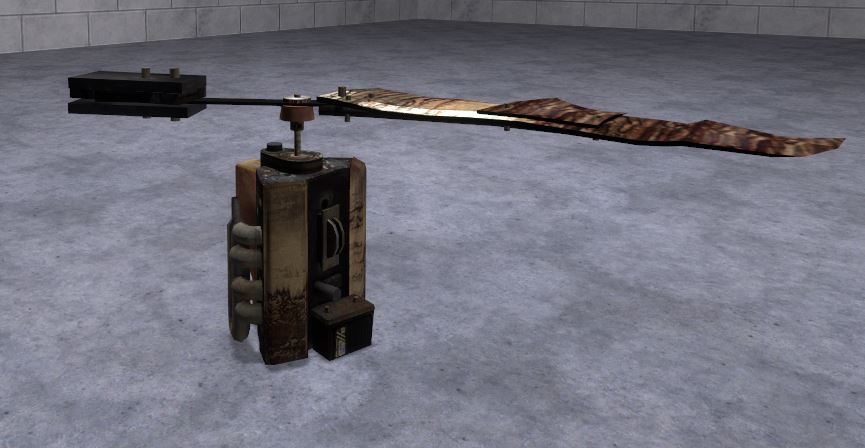
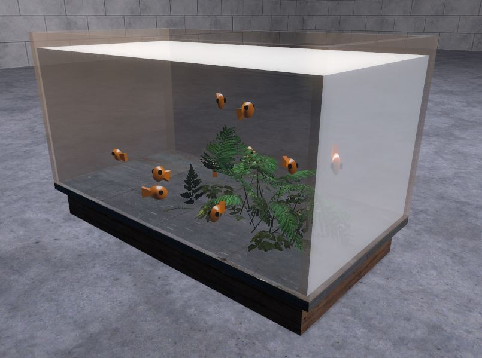
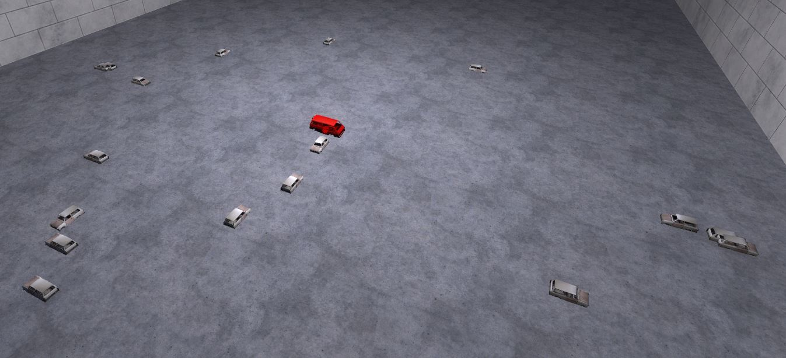
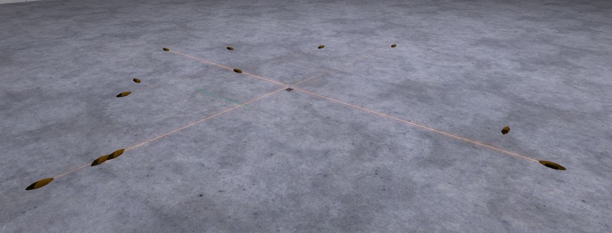
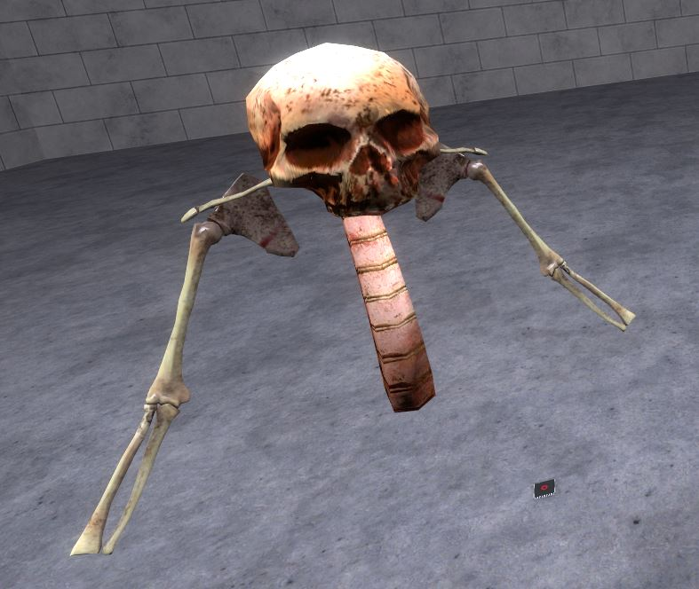

# Pack - [E2] AI release thread

## Details

### Author

- Author: postman ([TBU-TEC] THE P)
- Steam Profile: https://steamcommunity.com/profiles/76561197997916844
- YouTube: https://www.youtube.com/@blankrofl

### Publication Info

- Title: [E2] AI release thread
- Date (dd-mm-yyyy): 07-11-2011
- Source: https://web.archive.org/web/20150724031255/http://www.wiremod.com/forum/finished-contraptions/27846-e2-ai-release-thread.html#post249003
- Source Accessed (dd-mm-yyyy): 30-08-2025

## Description

Now first off a description:  
None of these are *TRUE* AI's, but they do simulate or respond to the environment, and that's as close as you can get in e2.

This is my second release thread, and with much fewer e2's than the last one, so it should be more organized etc.

Again as I said in my last one, don't judge based on the code I post, quite a few of these were written many months ago and i just now decided to release them.

---

### Engine Bird

First is engine bird  
Instructions:spawn chip  
<!-- Pictures: -->

  

<!--

-->

---

### Aquarium

And now An aquarium  
Instructions:spawn and wait for all fish to spawn (changeable amount in chip)  
also the fish like bug bait, throw one into the tank and watch em nom it.

  

<!--

-->

---

### Kamikaze Cars

> [!Warning]
> High ops

Instructions: spawn e2 and watch the cars
<!-- Pictures: -->

  

<!--

-->

---

### Holo Roaches

> [!Warning]
> High ops

Instructions: spawn in a place with walls or obstructions, try capturing the roaches or squishing them
<!-- pictures: -->

  

<!--

-->

---

### Uncle Fungus

Instructions:spawn chip, spawn a skull, crouch to bring him infront of you. Rope anything to him, proceed.

  

<!--

-->

---

### Postman Physgun

I KNOW this isnt an AI chip, but i wanted to squeeze it in
(right after this im also making an in depth thread about a stargate i made, AND a thread about a holo dashboard i made).

#### Name

Postman physgun

#### Instructions

If you want to be able to rotate the actual physgun in any direction (no gimbal lock), spawn 4 numbpad inputs (8,4,6,5), and wire the e2 (up down left right) to those numpads.

#### Controls

Get out something other than the gmod physgun  
Works like a normal physgun, besides rotating the actual physgun.  
Crouch + E throws it (let go of holding at the right time)

*I know its glitchy, i know it has issues, i know it sucks, but its cool to say the least.*

<!-- Picture: -->
