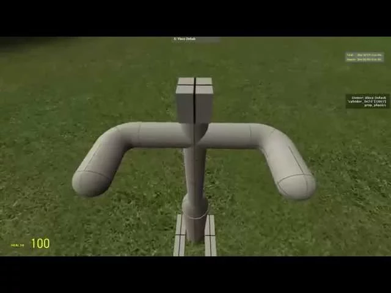

# Project - Simple Pogo Stick

## Details

### Author

- Author: Vince Defash (VinceD70)
- Steam Profile: https://steamcommunity.com/profiles/76561197990020012
- YouTube: https://www.youtube.com/@MrVinceDefash
- Pastebin: https://pastebin.com/u/VinceD70

### Publication Info

- Title: Simple Pogo Stick
- Date (dd-mm-yyyy): 23-04-2015
- Source: https://web.archive.org/web/20150509230313/http://www.wiremod.com:80/forum/finished-contraptions/34338-simple-pogo-stick.html
- Source: https://www.youtube.com/watch?v=-DC2_Pob4ls
- Source: https://pastebin.com/7Kwn89cm
- Source Accessed (dd-mm-yyyy): 27-08-2025

## Description

Video:  
[YouTube - Gmod simple pogo stick](https://www.youtube.com/watch?v=-DC2_Pob4ls)

Simple control, M1 = bounce around.

[PogoStickE2 - Pastebin.com](https://web.archive.org/web/20150509230313/http://pastebin.com/7Kwn89cm)

!ISSUES!
I can't find a way to control movement. I need help with that.
I need a way to stabilize without Keep upright, my angle stabilization is derpy.
