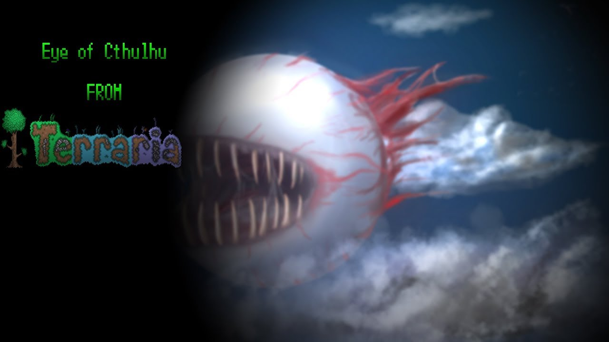
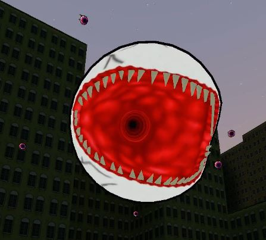

# PAC3 - Eye of Cthulhu from Terraria

## Details

### Author

- Author: Traine ZeroOne
- Steam Profile: http://steamcommunity.com/profiles/76561198059511685
- YouTube: https://www.youtube.com/@Traine01

### Publication Info

- Title: [Pac 3] Outfit " Eye of Cthulhu from Terraria " +DOWNLOAD
- Date (dd-mm-yyyy): 30-07-2017
- Source: https://www.youtube.com/watch?v=Q2-1iszj6Kc
- Source: https://www.dropbox.com/scl/fi/5rjpn3ftbdlbwlf9ty0k0/Eye-of-Cthulhu.txt?rlkey=d20fob596p6dxz7zrz6wqna1k&e=1&dl=0
- Source Accessed (dd-mm-yyyy): 29-06-2025

## Description

======================================================================

I don't remember how much time it took (it's pretty old pac)  
Download: [https://www.dropbox.com/s/db4slajs90c...](https://www.dropbox.com/scl/fi/5rjpn3ftbdlbwlf9ty0k0/Eye-of-Cthulhu.txt?rlkey=d20fob596p6dxz7zrz6wqna1k&e=1&dl=0)

CONTROLS:

- To transform, write in console bind button "pac_event ship 2" THEN press the button you binded.
- To Dash press R

My steam: [http://steamcommunity.com/profiles/76...](http://steamcommunity.com/profiles/76561198059511685)

All credits for model and textures goes to Astute  
Thank you guys for your support, you really inspire me to make more pacs!  
GUYS, when we'll hit 400 subs, i will release some cool downloadable pacs! :D

### Video

[YouTube - [Pac 3] Outfit " Eye of Cthulhu from Terraria " +DOWNLOAD](https://www.youtube.com/watch?v=Q2-1iszj6Kc)

### Images

  
  

<!--

-->
