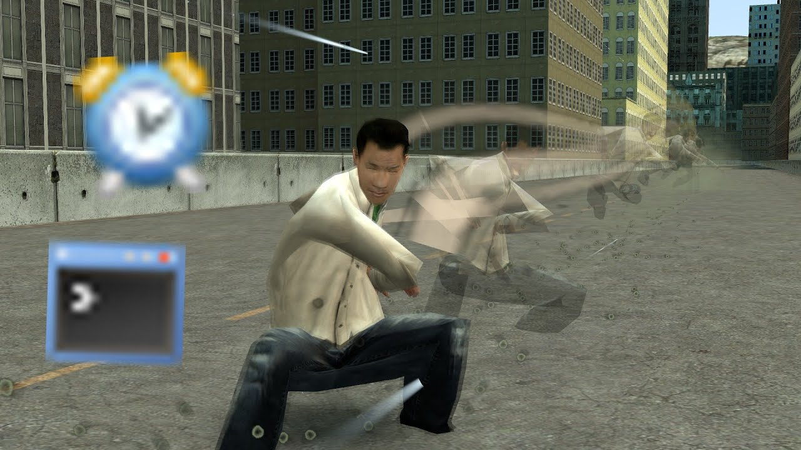

# PAC3 - [Timerx Events & Commands] How I move my character - gmod pac3 tutorial

## Details

### Author

- Author: penguon (Penguin) (pasta_penguinie)
- Steam Profile: https://steamcommunity.com/profiles/76561198121215700
- YouTube: https://www.youtube.com/@penguon4747

### Publication Info

- Title: [Timerx Events & Commands] How I move my character - gmod pac3 tutorial
- Date (dd-mm-yyyy): 19-08-2022
- Source: https://www.youtube.com/watch?v=Opmk9R6UjT0
- Source: https://www.dropbox.com/scl/fi/pc7dcyssd1dyn1lmwjfk2/timerx-example.txt?rlkey=mkndqbqomjy0xm0mmnlwq5jcm&dl=0
- Source: https://www.dropbox.com/scl/fi/l7s2cpmui1kr2mb8dt9vf/dash-sample.txt?rlkey=pm9xi8i177gdrj4plnnaew94w&e=1&dl=0
- Source Accessed (dd-mm-yyyy): 28-09-2025

## Description

Video:  
[YouTube - [Timerx Events & Commands] How I move my character - gmod pac3 tutorial](https://www.youtube.com/watch?v=Opmk9R6UjT0)

rainbow eyes - https://www.dropbox.com/scl/fi/pc7dcyssd1dyn1lmwjfk2/timerx-example.txt?rlkey=mkndqbqomjy0xm0mmnlwq5jcm&e=1&dl=0

dash move - https://www.dropbox.com/scl/fi/l7s2cpmui1kr2mb8dt9vf/dash-sample.txt?rlkey=pm9xi8i177gdrj4plnnaew94w&e=1&dl=0
