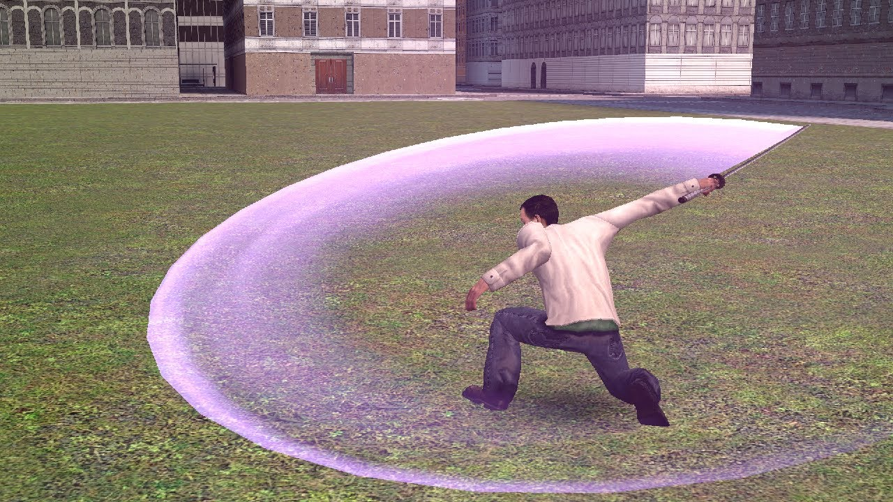

# PAC3 - How I make my slash effects - gmod pac3 tutorial

## Details

### Author

- Author: penguon (Penguin) (pasta_penguinie)
- Steam Profile: https://steamcommunity.com/profiles/76561198121215700
- YouTube: https://www.youtube.com/@penguon4747

### Publication Info

- Title: How I make my slash effects - gmod pac3 tutorial
- Date (dd-mm-yyyy): 08-08-2022
- Source: https://www.youtube.com/watch?v=Ni-pKo52qU4
- Source: https://www.dropbox.com/scl/fi/q2smp8i3mqrw8zlg6zmqn/slash-example.txt?rlkey=2vlkbi7hv0tqosec40rqg49su&e=1&st=wz9ki4r3&dl=0
- Source Accessed (dd-mm-yyyy): 28-09-2025

## Description

Video:  
[YouTube - How I make my slash effects - gmod pac3 tutorial](https://www.youtube.com/watch?v=Ni-pKo52qU4)



first tutorial :00

1-1 clamp expression: ```1-clamp(timeex()*10,0,1)```  
idk what the 0 in the middle does

download this example: https://www.dropbox.com/scl/fi/q2smp8i3mqrw8zlg6zmqn/slash-example.txt?rlkey=2vlkbi7hv0tqosec40rqg49su&e=1&st=wz9ki4r3&dl=0
