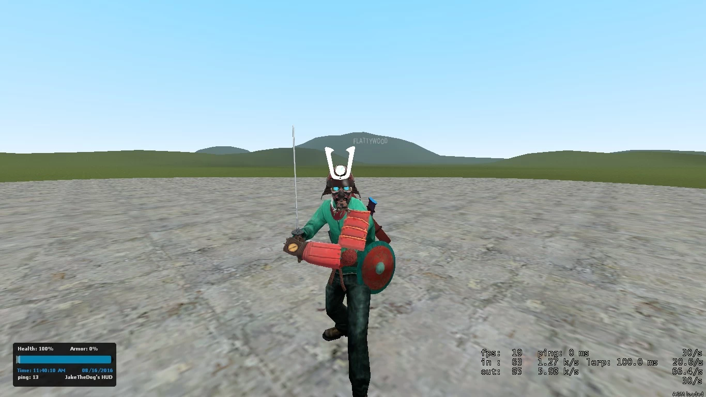

# PAC3 - Pac3 Editor - Samurai

## Details

### Author

- Author: Solrick
- Steam Profile: http://steamcommunity.com/profiles/76561198045949858
- Discord: https://discord.gg/zjQyK
- Twitter: b6eeb2c50a42412

### Publication Info

- Title: Pac3 Editor - Samurai
- Date (dd-mm-yyyy): 06-12-2021
- Source: https://gamebanana.com/mods/37583
- Source Accessed (dd-mm-yyyy): 19-06-2025

## Description

Hello there!
I submitting my first best Pac3 editor skin - Samurai.

### To install that skin you should

1. Unzip File to get "Samurai - complete.txt"
2. Then send it to your Steam\steamapps\common\GarrysMod\garrysmod\data\pac3
3. Go to Garry's Mod and Load it!
4. And to see the correct skin recommended to use player model - male03
5. Have fun! :D

### Main Weapons\Tools

- Fists
- Crowbar
- Physgun
- none (known like hands)

Also to charge your weapon use button [ g ]

### Credits

- Solrick
- JakeTheDog: modeler

### Images

