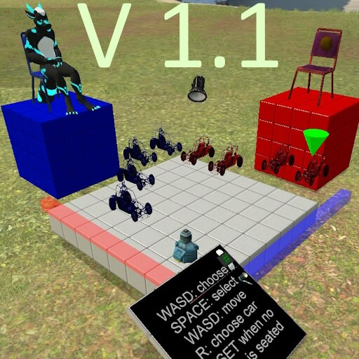
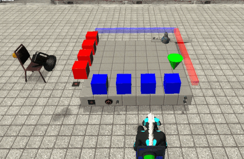

# Dupe - Dodgem game [Wiremod]

## Details

### Author

- Author: Kolore!
- Steam Profile: https://steamcommunity.com/profiles/76561197962439816

### Publication Info

- Title: Dodgem game [Wiremod]
- Date (dd-mm-yyyy): 15-06-2024
- Edited Date (dd-mm-yyyy): 05-01-2015
- Source: https://steamcommunity.com/sharedfiles/filedetails/?id=3268119404
- Source Accessed (dd-mm-yyyy): 19-08-2025

## Description

  

<!--

-->

2 player game, Tabletop car game by Colin Vout  
Porting by Kolore!  
To be found in "Dupes" section

### Instructions

1. Turn on the game, choose a seat
2. WASD: choose the car to move
3. SPACE: confirm
4. WASD: move the car
5. [R to eventually Regret your car choice]

NOTE: WASD as the movement keys, R refers to the reload action

### What is it?!?

It's an abstract tabletop game with cars.
Every player must drive all their cars to the finish lane.
The winner is the player who drove all their cars out of the game

### Things to note

- Cars cannot move backwards.
if you block all the opponent cars, you lose the game!

- the reset button works only if less than 2 players are seated;
this prevents griefers to reset the game while a match is playing

- To see the car models you have to set server convar 'wire_holograms_modelany' to 1

- this was a lot of work & tweak (one year on and off) !
If you want to edit it and create new things based on it, just ask! I can help :)
I prefer that, just to know who used it and why!

- this is a game that dragons can play.
But even other reptiles, other animals (even humans!) can approach it!

### Thanks to

- metastruct players who tried it, friends and strangers
- friends who liked playing it!
- other players in other servers
- wiremod team, wiremod addon

