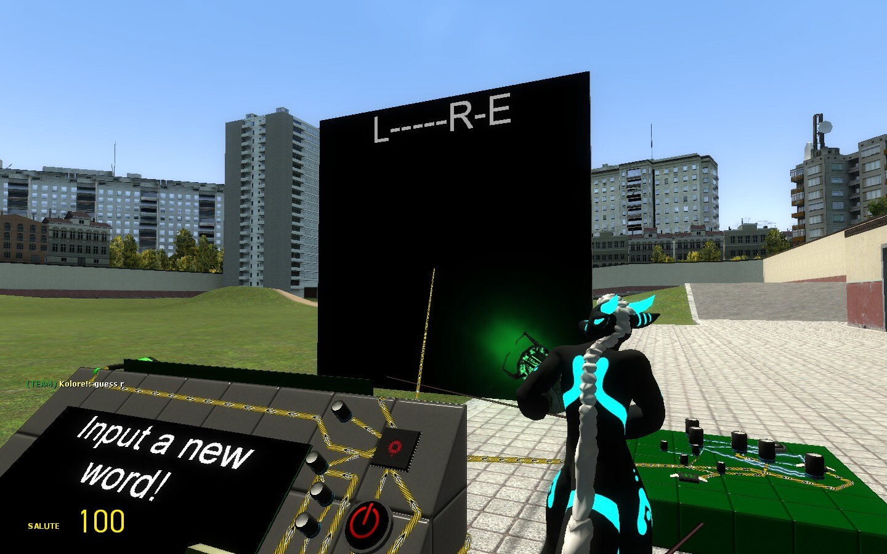

# Dupe - Hangman - guess word [Wiremod game]

## Details

### Author

- Author: Kolore!
- Steam Profile: https://steamcommunity.com/profiles/76561197962439816

### Publication Info

- Title: Hangman - guess word [Wiremod game]
- Date (dd-mm-yyyy): 06-07-2022
- Edited Date (dd-mm-yyyy): 29-07-2024
- Source: https://steamcommunity.com/sharedfiles/filedetails/?id=2831278724
- Source Accessed (dd-mm-yyyy): 19-08-2025

## Description

<p float="left">
  
</p>

<!--

-->

Guessing word game in wiremod

2+ players game
Perfect for party games!

### Usage

```plaintext
1 - input a word by keyboard USE, exit by pressing ALT
2 - give hints about the word
3 - let the player guess the word:

in chat say
> "guess L" where L is the letter
> "guess WORD" for the entire word

4 - reset the game by the ON\OFF button

Ropes can be removed
Big screen can be removed
words are limited to 25 letters, including spaces
```

-----

*if you wish to edit it for a newer version, please let me know!
*can be studied :)
*uses wiremod gates and a little chip
*thanks for playtesting on various servers
