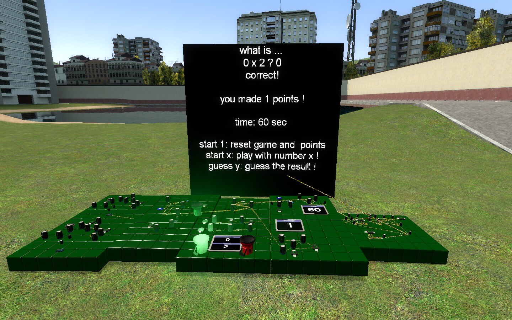

# Dupe - [Wiremod] multiplication game

## Details

### Author

- Author: Kolore!
- Steam Profile: https://steamcommunity.com/profiles/76561197962439816

### Publication Info

- Title: [Wiremod] multiplication game
- Date (dd-mm-yyyy): 17-04-2022
- Edited Date (dd-mm-yyyy): 18-04-2022
- Source: https://steamcommunity.com/sharedfiles/filedetails/?id=2795997660
- Source Accessed (dd-mm-yyyy): 19-08-2025

## Description

<p float="left">
  
</p>

<!--

-->

Use with chat, say:

```plaintext
> "start 1" : reset the game
> "start 4" : play with number 4 !
> "guess 8" : guess the result !
```

Reset the game when you want to start a new match.
When you'll play a match, you'll have only 60 seconds to guess as many answers as you can!

Be the "ultimate multiplicator"!

1+ dragonesque players game

Thanks for everyone who helped:

- tokoyami's furry discord
- people around the servers ( the sewers )
